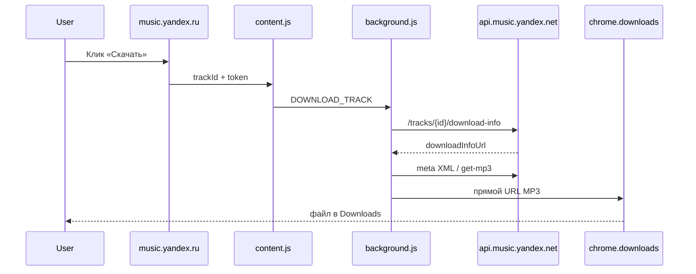

# YDM — Yandex Music Downloader

Chrome-расширение (Manifest V3) для **личного** скачивания треков с [Яндекс.Музыки](https://music.yandex.ru). На страницах плейлистов, альбомов и в поиске рядом с треками появляется кнопка **⬇ Скачать**.

> ⚠️ Только для личного использования. Не для публикации в Chrome Web Store. Нужна подписка **Яндекс.Плюс** для полных треков. Использование может противоречить условиям сервиса Яндекс.Музыки — на ваш риск.

**Репозиторий:** https://github.com/isalnikov/YDM

## Возможности

- Кнопки скачивания у треков (`.d-track` и fallback-селекторы)
- OAuth API `api.music.yandex.net` (актуальный формат `download-info` / `get-file-info`)
- Автосохранение токена из `#access_token=` в URL после авторизации
- Прямое скачивание MP3 через `chrome.downloads` (без blob в Service Worker)
- Конвертация M4A → MP3 через **ffmpeg.wasm** в Offscreen Document
- Подробные логи с префиксом `[YM-EXT]` в консоли и Service Worker

## Быстрый старт

### 1. Клонирование

```bash
git clone https://github.com/isalnikov/YDM.git
cd YDM
```

### 2. Установка в Chrome

1. Откройте `chrome://extensions/`
2. Включите **Режим разработчика**
3. **Загрузить распакованное расширение** → выберите папку:

   ```
   YDM/yandex-music-downloader
   ```

4. В папке `yandex-music-downloader/lib/` уже должны быть файлы ffmpeg (~31 MB). Если их нет — см. раздел [Сборка lib/](#сборка-lib).

### 3. OAuth-токен (обязательно)

Старый API через cookies/handlers **больше не работает** (404). Нужен OAuth-токен:

1. Откройте popup расширения → **«Получить токен (OAuth)»**
2. Войдите в Яндекс и разрешите доступ
3. Скопируйте `access_token` из адресной строки (между `access_token=` и `&`)
4. Вставьте в popup → **«Сохранить токен»**

Или откройте страницу вида:

```
https://music.yandex.ru/#access_token=...
```

Токен сохранится автоматически (v1.3+).

Подробнее: [Получение токена — Yandex Music API](https://ym.marshal.dev/token/)

### 4. Скачивание

1. Откройте плейлист или альбом на music.yandex.ru
2. Нажмите **⬇ Скачать** у нужного трека
3. Файл появится в папке загрузок: `YandexMusic/Исполнитель - Название.mp3`

## Структура репозитория

```
YDM/
├── README.md                 # этот файл
├── TODO.md                   # ТЗ и промпт для разработки
└── yandex-music-downloader/  # исходники расширения Chrome
    ├── manifest.json
    ├── background.js         # Service Worker — API, скачивание
    ├── content.js            # кнопки на странице
    ├── page-bridge.js        # перехват OAuth (MAIN world)
    ├── utils.js
    ├── converter.html/js     # ffmpeg.wasm (Offscreen)
    ├── popup.html/js
    ├── lib/                  # ffmpeg-core (~31 MB)
    └── icons/
```

## Как это работает



1. **content.js** — находит треки, вставляет кнопки, передаёт OAuth-токен
2. **background.js** — запросы к API, сборка прямой ссылки на MP3
3. **chrome.downloads** — скачивание по HTTP URL (MP3)
4. **converter** (Offscreen) — конвертация, если формат не MP3

## Сборка lib/

Если `lib/` пустая после клонирования (редко — файлы в git):

```bash
cd yandex-music-downloader
npm install @ffmpeg/ffmpeg@0.12.10 @ffmpeg/core@0.12.6
cp node_modules/@ffmpeg/core/dist/umd/ffmpeg-core.js lib/
cp node_modules/@ffmpeg/core/dist/umd/ffmpeg-core.wasm lib/
cp node_modules/@ffmpeg/ffmpeg/dist/umd/ffmpeg.js lib/ffmpeg.min.js
cp node_modules/@ffmpeg/ffmpeg/dist/umd/814.ffmpeg.js lib/
```

## Отладка

Логи включены по умолчанию. Фильтр в консоли: `YM-EXT`

| Компонент | Где смотреть |
|-----------|--------------|
| Страница Яндекс.Музыки | F12 → Console |
| Service Worker | `chrome://extensions` → «Service Worker» |
| Offscreen (ffmpeg) | `chrome://extensions` → offscreen |

### Типичные ошибки

| Сообщение | Решение |
|-----------|---------|
| `OAuth-токен не найден` | Сохраните токен в popup |
| `available=false` | Трек недоступен — выберите другой |
| `no-rights` | Нет прав / подписка / регион |
| `URL.createObjectURL is not a function` | Обновите до v1.3.1+ |

## Ограничения

- Только **ручное** скачивание по клику (не массовое)
- **Яндекс.Плюс** для полных треков
- **DRM / HLS** не поддерживаются
- Папка сохранения — только через настройки Chrome (`chrome://settings/downloads`)
- Яндекс может менять API и вёрстку — потребуется обновление селекторов

## Версия

Текущая версия расширения: **1.3.1** (см. `yandex-music-downloader/manifest.json`).

## Лицензия и ответственность

Проект предназначен для личного архивирования музыки, на которую у вас есть права по подписке. Авторы не поощряют нарушение авторских прав и условий использования Яндекс.Музыки. Не распространяйте скачанные файлы.

## См. также

- [README расширения](yandex-music-downloader/README.md) — детали по файлам
- [TODO.md](TODO.md) — исходное техническое задание
