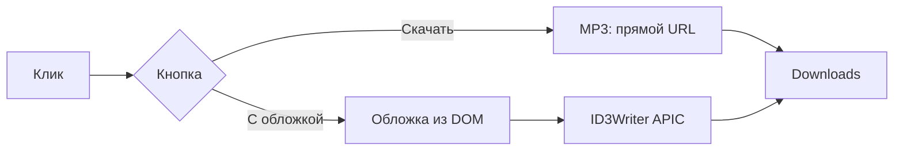

# YDM — Yandex Music Downloader

Chrome-расширение (Manifest V3) для **личного** скачивания треков с [Яндекс.Музыки](https://music.yandex.ru). Рядом с каждым треком — две кнопки: быстрое скачивание и скачивание **с обложкой** в MP3.

> ⚠️ Только для личного использования. Не для публикации в Chrome Web Store. Нужна подписка **Яндекс.Плюс** для полных треков. Использование может противоречить условиям сервиса Яндекс.Музыки — на ваш риск.

**Репозиторий:** https://github.com/isalnikov/YDM

## Возможности

- Две кнопки у трека: **⬇ Скачать** (быстро) и **🖼 С обложкой** (ID3 + превью в проводнике)
- OAuth API `api.music.yandex.net` (`download-info` / `get-file-info`)
- Автосохранение токена из `#access_token=` в URL
- **Быстрый режим:** MP3 скачивается напрямую по URL (как в v1.3.1)
- **С обложкой:** обложка из строки трека (картинка у play) → ID3v2.3 **APIC** через `browser-id3-writer` (VLC, Nautilus/Ubuntu)
- M4A → MP3 через **ffmpeg.wasm** (Offscreen), теги — через ID3Writer
- Селекторы для классического `.d-track` и нового UI (`PlayButtonWithCover_coverImage`)

## Быстрый старт

### 1. Клонирование

```bash
git clone https://github.com/isalnikov/YDM.git
cd YDM
```

### 2. Установка в Chrome

1. Откройте `chrome://extensions/`
2. Включите **Режим разработчика**
3. **Загрузить распакованное расширение** → папка `YDM/yandex-music-downloader`
4. В `lib/` должны быть `ffmpeg-core.*`, `ffmpeg.min.js`, `browser-id3-writer.mjs` (~31 MB). Если чего-то нет — см. [Сборка lib/](#сборка-lib)

### 3. OAuth-токен (обязательно)

Cookies/handlers API **не работают**. Нужен OAuth-токен:

1. Popup расширения → **«Получить токен (OAuth)»**
2. Войдите в Яндекс, скопируйте `access_token` из адресной строки
3. Вставьте в popup → **«Сохранить токен»**

Или откройте `https://music.yandex.ru/#access_token=...` — токен сохранится сам.

Инструкция: https://ym.marshal.dev/token/

### 4. Скачивание

| Кнопка | Что делает |
|--------|------------|
| **⬇ Скачать** | Быстро: MP3 — прямая загрузка; M4A — конвертация без обложки |
| **🖼 С обложкой** | Обложка + название/исполнитель в тегах; превью в файловом менеджере |

Файлы: `YandexMusic/Исполнитель - Название.mp3`

## Структура репозитория

```
YDM/
├── README.md
├── TODO.md
└── yandex-music-downloader/
    ├── manifest.json
    ├── background.js       # API, скачивание, маршрутизация
    ├── content.js          # кнопки, обложка со страницы
    ├── page-bridge.js       # OAuth (MAIN world)
    ├── utils.js
    ├── converter.html
    ├── converter.mjs         # ffmpeg + ID3Writer (ES module)
    ├── popup.html/js
    ├── lib/
    │   ├── ffmpeg-core.*
    │   ├── ffmpeg.min.js
    │   └── browser-id3-writer.mjs
    └── icons/
```

## Как это работает



1. **content.js** — кнопки, URL обложки из `img` в строке трека
2. **background.js** — API Яндекса, выбор быстрого или полного пути
3. **converter.mjs** — ffmpeg только для M4A; APIC для Nautilus — **browser-id3-writer** (ID3v2.3)
4. **chrome.downloads** — сохранение (прямой URL или blob из offscreen)

## Сборка lib/

```bash
cd yandex-music-downloader
npm install @ffmpeg/ffmpeg@0.12.10 @ffmpeg/core@0.12.6 browser-id3-writer@6.3.1
cp node_modules/@ffmpeg/core/dist/umd/ffmpeg-core.js lib/
cp node_modules/@ffmpeg/core/dist/umd/ffmpeg-core.wasm lib/
cp node_modules/@ffmpeg/ffmpeg/dist/umd/ffmpeg.js lib/ffmpeg.min.js
cp node_modules/@ffmpeg/ffmpeg/dist/umd/814.ffmpeg.js lib/
cp node_modules/browser-id3-writer/dist/browser-id3-writer.mjs lib/
```

## Отладка

Фильтр в консоли: `YM-EXT` (логируются только ключевые действия и ошибки).

| Компонент | Где смотреть |
|-----------|--------------|
| Страница | F12 → Console |
| Service Worker | `chrome://extensions` → Service Worker |
| Offscreen | `chrome://extensions` → offscreen |

| Сообщение | Решение |
|-----------|---------|
| `OAuth-токен не найден` | Сохраните токен в popup |
| `Обложка не найдена` | Используйте **🖼 С обложкой** только если в строке видна картинка |
| `available=false` | Трек недоступен / нет Плюс |

## Ограничения

- Только ручное скачивание по клику
- **Яндекс.Плюс** для полных треков
- DRM / HLS не поддерживаются
- Обложка в проводнике — только через **🖼 С обложкой**
- Яндекс может менять API и вёрстку

## Версия

**1.7.1** — см. `yandex-music-downloader/manifest.json`

## Лицензия

Для личного архивирования при действующей подписке. Не распространяйте скачанные файлы.

## См. также

- [README расширения](yandex-music-downloader/README.md)
- [TODO.md](TODO.md)
